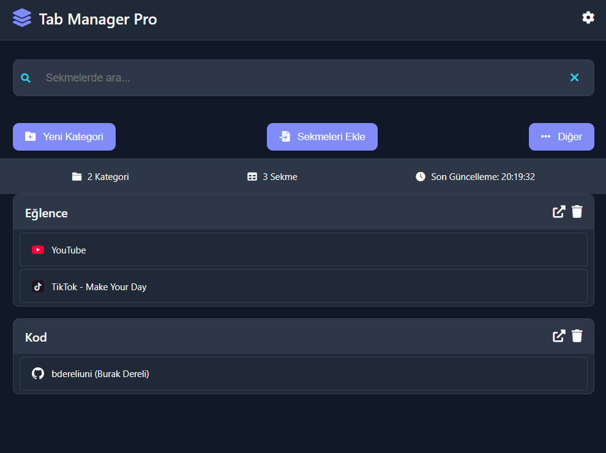

# Modern Sekme Yöneticisi

Modern Sekme Yöneticisi, tarayıcınızda açık olan sekmeleri daha iyi yönetmenizi ve organize etmenizi sağlayan gelişmiş bir araçtır. Kullanıcı dostu arayüzü ve güçlü özellikleri ile sekmelerinizi kategorilere ayırabilir, arama yapabilir ve daha fazlasını gerçekleştirebilirsiniz.

## Özellikler

- **Kategorilere Ayırma:** Sekmeleri düzenli bir şekilde kategorilere ayırın.
- **Karanlık Mod:** Göz yormayan bir deneyim için karanlık mod.
- **Sekme Arama:** Açık sekmeler arasında hızlı arama yapın.
- **Sürükle-Bırak:** Sekmeleri kolayca farklı kategorilere taşıyın.
- **Veri Yedekleme:** Kategorileri ve sekmeleri JSON formatında yedekleyin veya geri yükleyin.
- **İstatistikler:** Toplam kategori ve sekme sayısını görüntüleyin.

## Kurulum

1. Bu projeyi klonlayın veya indirin.
2. Tarayıcınızda `chrome://extensions/` adresine gidin.
3. "Geliştirici Modu"nu etkinleştirin.
4. "Paketlenmemiş Yükle" butonuna tıklayın ve proje klasörünü seçin.

## Kullanım

- **Yeni Kategori Oluşturma:** "Yeni Kategori" butonuna tıklayarak yeni bir kategori oluşturabilirsiniz.
- **Sekmeleri Ekleme:** "Sekmeleri Ekle" butonuna tıklayarak mevcut sekmeleri seçili kategoriye ekleyebilirsiniz.
- **Kategorileri Sıralama:** "Sırala" butonuna tıklayarak kategorileri alfabetik veya sekme sayısına göre sıralayabilirsiniz.
- **Kategorileri Temizleme:** "Temizle" butonuna tıklayarak tüm kategorileri ve sekmeleri silebilirsiniz.

## Katkıda Bulunma

Katkıda bulunmak isterseniz, lütfen bir pull request gönderin veya bir issue açın. Her türlü geri bildirime açığız!

## Lisans

Bu proje MIT Lisansı ile lisanslanmıştır. Daha fazla bilgi için `LICENSE` dosyasına bakabilirsiniz.